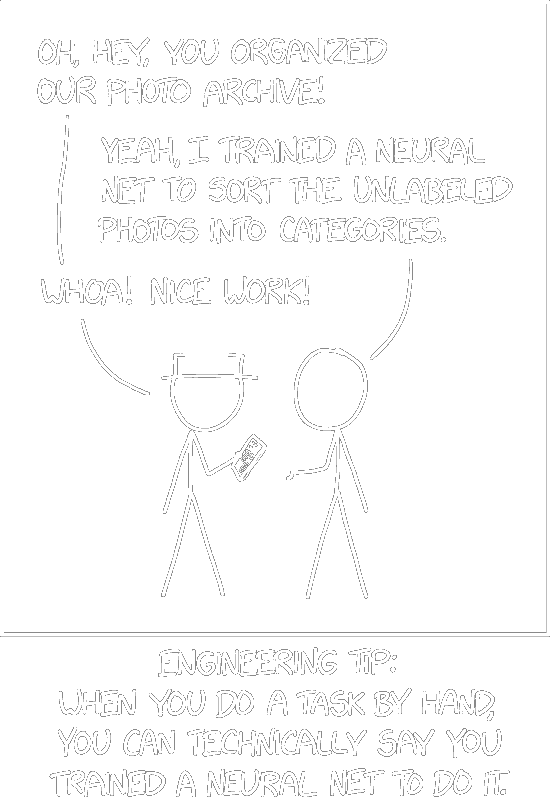

# Neural Sensing, Modeling, and Understanding

This graduate seminar explores selected topics in neural-driven
wireless sensing drawn from the recent research literature and
industry. Neural networks are opening up exciting new possibilities to
harness the ambient wireless and acoustic transmissions around us for
sensing purposes. Our smartphones, devices, and nearby cell towers and
hotspots provide readily available signals that neural networks can
analyze in order to create in situ models of the world, sense
movements, and enable navigation of autonomous agents.

Instructor: [Kyle Jamieson](https://www.cs.princeton.edu/~kylej/)

{:style="text-align:center;"}
{:width="35%"}

Image credit: [xkcd](https://xkcd.com/2173/)

This seminar is open to graduate students; undergraduate seniors
interested in taking this course require permission from the
instructor.  COS 461, ECE/COS 368, COS 333, COS 318, COS 316, and COS
217 are all relevant to the material in 597S.  All participants of the
seminar are required to present papers and lead discussions. Students
taking this seminar for credit are required to complete an independent
project either individually or in a small team, and deliver a project
presentation at the end of the semester.

## Schedule

- Tuesdays, 2:55 PM--4:15 PM: Seminar Meeting in 301 Computer Science
- Thursdays, 2:55 PM--4:15 PM: Seminar Meeting in 301 Computer Science

## Grading

- Participation: 30% (of this, 50% Perusall, 50% in-person)
- Oral Presentations: 30% (of this, 50% paper presentations, 50% design project presentation)
- Research Project (due on Dean’s Date): 40%
