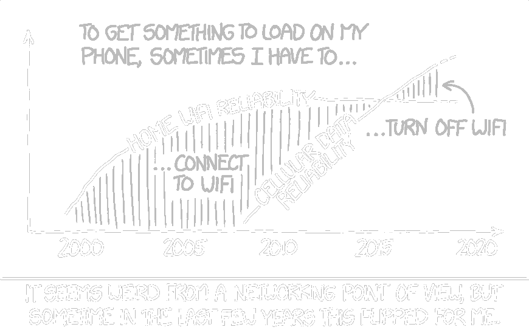

# Advanced Topics in Computer Science- Recent Advances in Wireless Networks
{:.no_toc}

{:width="65%"}

This graduate seminar will explore selected topics in wireless
networks drawn from the recent research literature and industry. The
approach is interdisciplinary and cross-layer, covering applications
and end-to-end transport protocols, as well as physical- and
link-layer design, aiming to gain an understanding of how their
interactions influence performance. Areas of interest will include
machine learning-based wireless channel modeling, 5G and Open RAN
network architecture, computational structures for physical-layer
processing, millimeter-wave reconfigurable intelligent surfaces, and
congestion control/queue management.

## Schedule

- Wednesdays, 11:50 PM: Online E-Discussion Deadline
- Fridays, 1:30 PM--2:50 PM: Seminar Meeting in 302 Computer Science
- Fridays, 3:00 PM--4:20 PM: Seminar Meeting in 302 Computer Science

## Grading

- Class/Precept Participation: 30% (of this, 50% Perusall, 50% in-person)

- Design Project (due on Dean’s Date): 40%

- Oral Presentations: 30% (of this, 50% paper presentation, 50% design project presentation)
